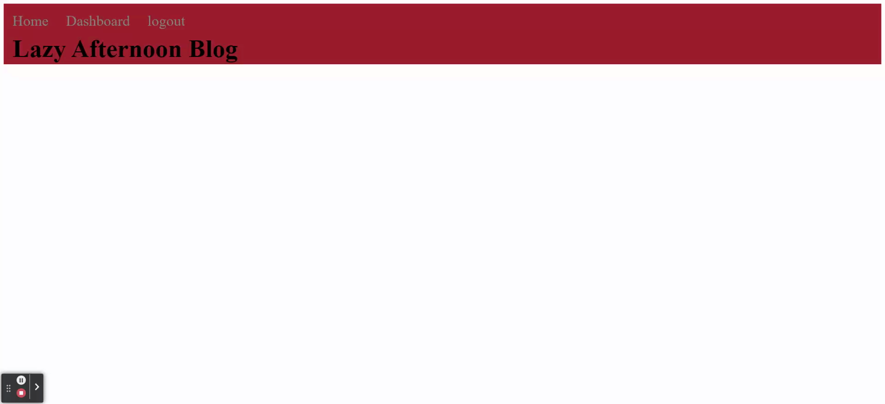

# Lazy Afternoon Blog

## Summary
This blog was developed to tackle the problem of not having a space to talk about specifically video game related topics. Now users can signup for the blog and make blog posts of their own!

[](https://www.gnu.org/licenses/gpl-3.0)

## Table of Contents
- [Installation](#installation)
- [Features](#features)
- [Testing](#testing)
- [Credits](#credits)
- [License](#license)
- [Questions](#questions)
- [Demo](#demo)

## Tech & Language used
- HTML 5
- CSS 3
- Javascript ES6+
- MySQL
- NodeJS
- Heroku

## Packages
- bcrypt
- dotenv
- express
- express-session
- express-handlebars
- connect-session-sequelize
- hbs
- mysql2
- sequelize

## Features
1. Create an account
2. Create, update, and delete blog posts
3. Create, update, and delete comments
4. View others posts and comments
5. Admins can delete all posts and comments

## Installation

To install this project, first clone the repository. Once the repo is cloned, navigate to the folder in your terminal and run the following command.
```md
npm install
```
This will install all the dependencies. Next you'll want to seed the database (Seed date needs to be updated). Run the following command to seed the database.
```md
npm run seed
```
After the seeds are done you can now start the server with this command.
```md
npm start
```

## Testing
Currently, there are no tests developed for this project.

## Credits
Revivedaniel (Sole developer)

## License
GNU GPLv3

## How to Contribute
If you would like to contribute to the development of the website, please contact me (Revivedaniel) or open an issue if a bug appears.

## Questions
* [gitHubLink](https://github.com/Revivedaniel)
* <a href="mailto:webdevstark@gmail.com<">webdevstark@gmail.com</a>

## Demo


## Live Site
https://lazy-afternoon-blog.herokuapp.com/
