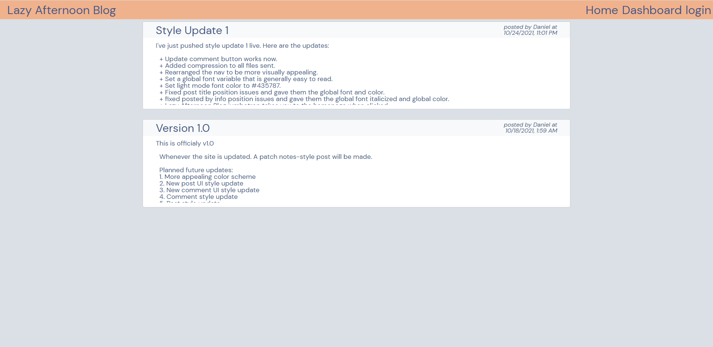

<div id="top"></div>

[![Contributors][contributors-shield]][contributors-url]
[![Forks][forks-shield]][forks-url]
[![Stargazers][stars-shield]][stars-url]
[![Issues][issues-shield]][issues-url]
[![License][license-shield]][license-url]


<!-- PROJECT LOGO -->
<br />
<div align="center">

<h1 align="center">Lazy Afternoon Blog</h1>

  <p align="center">
    Lazy Afternoon Blog is a blog site where users can post and share their thoughts about Video Games with other users. The site is built with Handlebars.js as the View and Express.js as the Controller. As for the database we are using Sequelize to interface interface with MySQL and model our data.
    <br />
    <br />
    <a href="#demo">View Demo</a>
    ·
    <a href="https://github.com/Revivedaniel/LazyAfternoonBlog/issues">Report Bug</a>
    ·
    <a href="https://github.com/Revivedaniel/LazyAfternoonBlog/issues">Request Feature</a>
  </p>
</div>


<!-- TABLE OF CONTENTS -->
<details>
  <summary>Table of Contents</summary>
  <ol>
    <li>
      <a href="#about-the-project">About The Project</a>
      <ul>
        <li><a href="#built-with">Built With</a></li>
      </ul>
    </li>
    <li>
      <a href="#getting-started">Getting Started</a>
      <ul>
        <li><a href="#prerequisites">Prerequisites</a></li>
        <li><a href="#installation">Installation</a></li>
      </ul>
    </li>
    <li><a href="#usage">Usage</a></li>
    <li><a href="#roadmap">Roadmap</a></li>
    <li><a href="#contributing">Contributing</a></li>
    <li><a href="#license">License</a></li>
    <li><a href="#contact">Contact</a></li>
    <li><a href="#acknowledgments">Acknowledgments</a></li>
  </ol>
</details>


<!-- ABOUT THE PROJECT -->
## About The Project

[](https://lazy-afternoon-blog.herokuapp.com/)

<p align="right">(<a href="#top">back to top</a>)</p>


### Built With

* [Node.js](https://nodejs.org/en/)
* [Express](https://www.npmjs.com/package/express)
* [Handlebars](https://www.npmjs.com/package/handlebars)
* [Sequelize](https://www.npmjs.com/package/sequelize)
* [bcrypt](https://www.npmjs.com/package/bcrypt)
* [Axios](https://www.npmjs.com/package/axios)


<p align="right">(<a href="#top">back to top</a>)</p>

## Demo


<!-- GETTING STARTED -->
## Getting Started

Get a local copy up and running by following these simple steps.

### Prerequisites

npm and Node.js are required to run a local copy of this project.
* npm
  ```sh
  npm install npm@latest -g
  ```
* [Node.js](https://nodejs.org/en/)


### Installation

1. Clone the repo
   ```sh
   git clone https://github.com/Revivedaniel/LazyAfternoonBlog.git
   ```
2. Install NPM packages
   ```sh
   npm install
   ```
3. Seed the database
   ```sh
   npm run seed
   ```
4. Start the server
   ```sh
   npm start
   ```

<p align="right">(<a href="#top">back to top</a>)</p>

<!-- ROADMAP -->
## Roadmap

- [] Rebuild in MERN stack
- [] User Profiles
- [] Tagging system

See the [open issues](https://github.com/Revivedaniel/LazyAfternoonBlog/issues) for a full list of proposed features (and known issues).

<p align="right">(<a href="#top">back to top</a>)</p>


<!-- CONTRIBUTING -->
## Contributing

Contributions are what make the open source community such an amazing place to learn, inspire, and create. Any contributions you make are **greatly appreciated**.

If you have a suggestion that would make this better, please fork the repo and create a pull request. You can also simply open an issue with the tag "enhancement".
Don't forget to give the project a star! Thanks again!

1. Fork the Project
2. Create your Feature Branch (`git checkout -b feature/AmazingFeature`)
3. Commit your Changes (`git commit -m 'Add some AmazingFeature'`)
4. Push to the Branch (`git push origin feature/AmazingFeature`)
5. Open a Pull Request

<p align="right">(<a href="#top">back to top</a>)</p>


<!-- LICENSE -->
## License

Distributed under the APGL-3.0 License. See `LICENSE.txt` for more information.

<p align="right">(<a href="#top">back to top</a>)</p>


<!-- CONTACT -->
## Contact

Daniel Stark - daniel@danielstark.dev

Project Link: [https://github.com/Revivedaniel/LazyAfternoonBlog](https://github.com/Revivedaniel/LazyAfternoonBlog)

<p align="right">(<a href="#top">back to top</a>)</p>

[contributors-shield]: https://img.shields.io/github/contributors/Revivedaniel/LazyAfternoonBlog.svg?style=for-the-badge
[contributors-url]: https://github.com/Revivedaniel/LazyAfternoonBlog/graphs/contributors
[forks-shield]: https://img.shields.io/github/forks/Revivedaniel/LazyAfternoonBlog.svg?style=for-the-badge
[forks-url]: https://github.com/Revivedaniel/LazyAfternoonBlog/network/members
[stars-shield]: https://img.shields.io/github/stars/Revivedaniel/LazyAfternoonBlog.svg?style=for-the-badge
[stars-url]: https://github.com/Revivedaniel/LazyAfternoonBlog/stargazers
[issues-shield]: https://img.shields.io/github/issues/Revivedaniel/LazyAfternoonBlog.svg?style=for-the-badge
[issues-url]: https://github.com/Revivedaniel/LazyAfternoonBlog/issues
[license-shield]: https://img.shields.io/github/license/Revivedaniel/LazyAfternoonBlog.svg?style=for-the-badge
[license-url]: https://github.com/Revivedaniel/LazyAfternoonBlog/blob/main/LICENSE